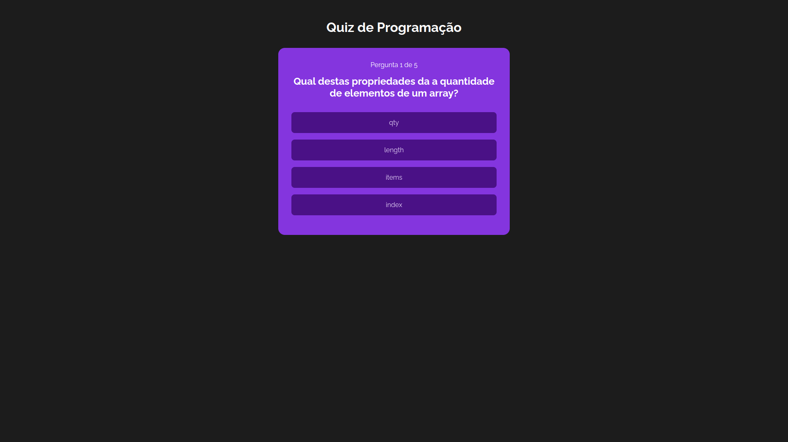

<h1 align="center">Quiz</h1>

A programming quiz made with ReactJS.

  <a href="#-layout">Layout</a>&nbsp;&nbsp;&nbsp;|&nbsp;&nbsp;&nbsp;
  <a href="#-technologies">Technologies</a>&nbsp;&nbsp;&nbsp;|&nbsp;&nbsp;&nbsp;
  <a href="#-project">Project</a>

 

## 🔥 Layout

   

## 🌐 Technologies
This project was developed with the following technologies:
- ReactJS with Vite.js

## 💻 Project
The quiz consists of multiple-choice questions that cover various programming topics.
The user will have a chance to select the option they believe is correct and try to answer as many questions as possible.

<!--- [Visit the project online](https://esthefany-dev.github.io/geradorQrCode/)-->
---
👩‍💻 by [Esthefany-Dev](https://github.com/Esthefany-Dev)

